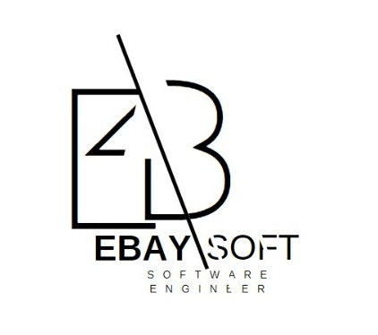
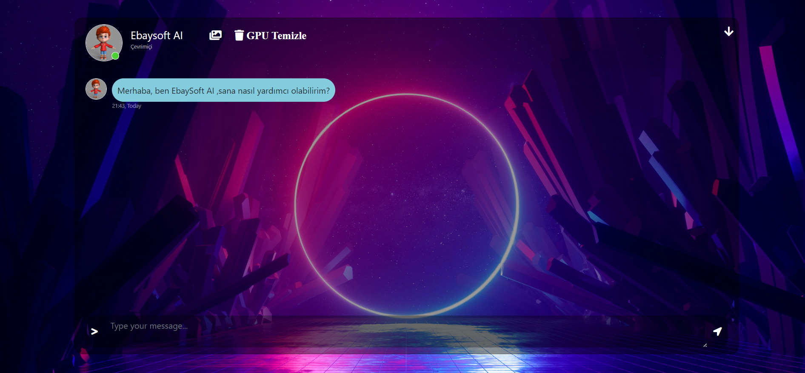
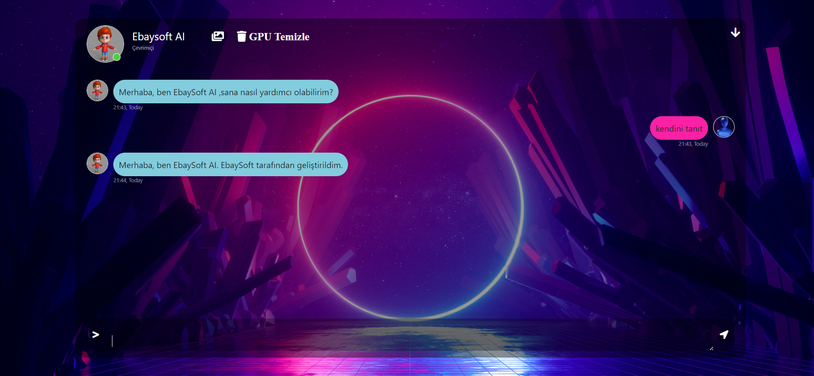
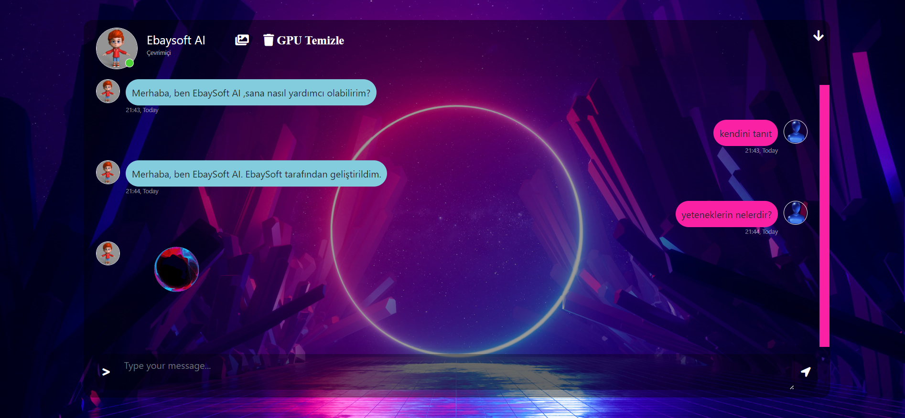
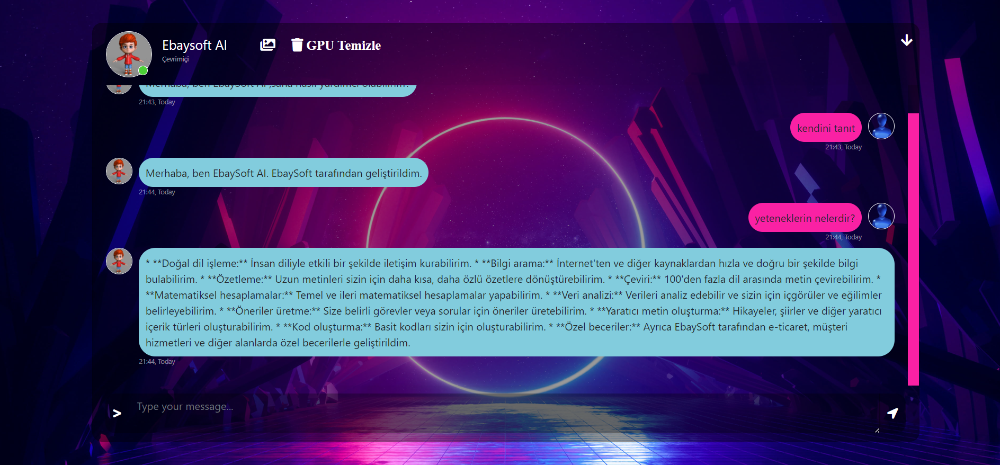
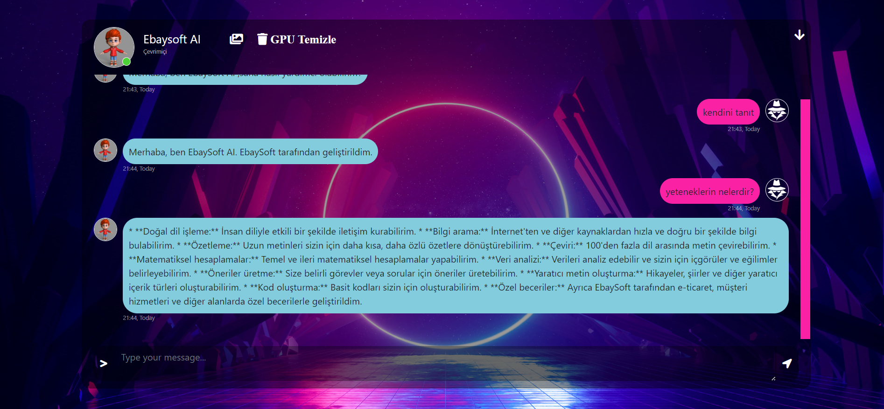

# ***EBAYSOFT- (EnesBAYri-SOFTware) AI***

    

  

<b>-> Google gemini yapay zekasını makine öğrenmesi alanında geliştirip eğiterek NODEJS - JavaScript kullanılarak geliştirmiş olduğum uygulama sizlerle!</b> 
<b>-> Öğenmek istediğiniz herşeyi sorabilir,sohbet edebilir hem kendinizi hemde yapay zekayı daha da geliştirip öğretebilirsiniz...</b> 
  

<b>-> Yapay zeka özellikleri ve yetenekleri:</b> 

<li><b>Doğal dil işleme</b></li>
İnsan diliyle etkili bir şekilde iletişim kurabilir.

<li><b>Bilgi arama</b></li>
İnternet'ten ve diğer kaynaklardan hızla ve doğru bir şekilde bilgi bulabilir.

<li><b>Özetleme</b></li>
Uzun metinleri sizin için daha kısa, daha özlü özetlere dönüştürebilir.

<li><b>Çeviri</b></li>
100'den fazla dil arasında metin çevirebilir.

<li><b>Matematiksel hesaplamalar</b></li>
Temel ve ileri matematiksel hesaplamalar yapabilir.

<li><b>Veri analizi</b></li>
Verileri analiz edebilir ve sizin için içgörüler ve eğilimler belirleyebilir.

<li><b>Öneriler üretme</b></li>
Size belirli görevler veya sorular için öneriler üretebilir.

<li><b>Yaratıcı metin oluşturma</b></li>
Hikayeler, şiirler ve diğer yaratıcı içerik türleri oluşturabilir.

<li><b>Kod oluşturma</b></li>
Basit kodları sizin için oluşturabilir.

<li><b>Özel beceriler</b></li>
Ayrıca EbaySoft tarafından e-ticaret, müşteri hizmetleri ve diğer alanlarda özel becerilerle geliştirildi. Bunlara ek olarak, sürekli olarak yeni yetenekler öğreniyor ve geliştiriliyor.

  

<b>-> Yapay zekaya bilmediği,anlamadığı yada tehlikeli sorular sorduğunuzda alacağınız yanıt:</b> 
 -> " Anlayamadım, üzgünüm... :( "

   

# Dikkat : "GPU Temizle"
<strong><b>-> Yapay zekanın öğrenme ve kendini geliştirme yeteneği vardır. Sizden öğrendikleri size vereceği cevapları da etkileyebilir! Örneğin adınızı söylediğinizde yapay zeka sonraki konuşmalarınızda artık adınızı biliyor olacaktır! Sizden önceki öğrendiklerini temizlemek isterseniz "GPU Temizle" butonuna basmanız yeterlidir...</b> </strong>

 
 

    <b>-> Yapay zekanın sizi karşılama ekranı <-</b> 
      

    <b>-> Yapay zeka kendini tanıtıyor... <-</b> 
      

    <b>-> Yapay zekanın sorunuzu yanıtlarken size yazdığını gösteren animasyon... <-</b> 
      

    <b>-> Yapay zekanın yetenekleri <-</b> 
      

    <b>-> Yapay zekayla olan sohbetinizde profil resmi ekleyebilir değiştirebilirsiniz... <-</b> 
      

    

